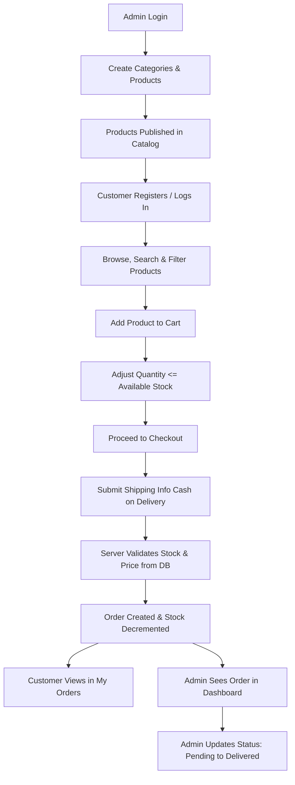

# 🛍️ Mini E-Commerce Demo Project (MERN Stack)

A clean, modern, and lightweight full-stack **Mini E-Commerce Demo Application** built with the **MERN Stack** (MongoDB, Express.js, React.js, Node.js) and styled with **Tailwind CSS**.

This project provides an end-to-end shopping experience for customers and a full-featured management dashboard for store administrators, without unnecessary enterprise complexity.

---

## 📑 Table of Contents

- [Project Overview](#-project-overview)
- [Tech Stack](#-tech-stack)
- [Repository Structure](#-repository-structure)
- [Key Features](#-key-features)
  - [Customer Experience](#customer-experience)
  - [Admin Experience](#admin-experience)
- [Main Demo Workflow](#-main-demo-workflow)
- [Architecture & Design Principles](#-architecture--design-principles)
- [Getting Started](#-getting-started)
  - [Prerequisites](#prerequisites)
  - [Environment Variables](#environment-variables)
  - [Backend Setup](#backend-setup)
  - [Frontend Setup](#frontend-setup)
- [Detailed Documentation Index](#-detailed-documentation-index)
- [Future Scope & Boundaries](#-future-scope--boundaries)

---

## 🎯 Project Overview

The objective of this project is to showcase clean architectural design, robust authentication, reliable inventory tracking, and responsive UI design using the MERN stack.

```
┌──────────────────────────────────────────────────────────┐
│                   MERN MINI E-COMMERCE                   │
├────────────────────────────┬─────────────────────────────┤
│      CUSTOMER STORE        │       ADMIN DASHBOARD       │
│  • Browse & Search Catalog │  • Category Management      │
│  • Category Filter         │  • Product CRUD & Stock     │
│  • Live Cart & Stock Check │  • Order Fulfillment        │
│  • Cash on Delivery Orders │  • Status Updates           │
└────────────────────────────┴─────────────────────────────┘
```

---

## 💻 Tech Stack

| Layer | Technology | Description |
| :--- | :--- | :--- |
| **Frontend** | React.js (v18+) | Component-based interactive UI |
| **Build Tool** | Vite | Lightning-fast development and bundling |
| **Language** | JavaScript (ES6+) | Modern JavaScript syntax |
| **Styling** | Tailwind CSS | Utility-first, responsive CSS framework |
| **HTTP Client** | Axios | Promise-based REST API client with interceptors |
| **Icons** | Lucide React | Clean, lightweight icon set |
| **Backend** | Node.js + Express.js | Fast, minimalist REST API server |
| **Database** | MongoDB + Mongoose | Document-oriented NoSQL database with ODM |
| **Authentication** | JWT + bcryptjs | Stateless token auth & secure salted password hashing |

---

## 📁 Repository Structure

The project is structured as a decoupled monorepo separating client and server concerns:

```text
E-com/
├── README.md                      # Project documentation and quick-start guide
├── docs/                          # Detailed specifications and roadmaps
│   ├── ARCHITECTURE.md            # System architecture, data flow & security
│   ├── DATABASE_SCHEMA.md         # Mongoose models, indexes & validations
│   ├── API_SPECIFICATION.md       # Complete REST API reference
│   ├── FRONTEND_SPECIFICATION.md  # UI/UX, routing & component specs
│   └── DEVELOPMENT_PLAN.md        # Step-by-step implementation roadmap
│
├── client/                        # React.js + Vite frontend (to be created)
│   ├── public/
│   ├── src/
│   │   ├── assets/                # Static assets & placeholder images
│   │   ├── components/            # Reusable UI components (Navbar, Modal, Card)
│   │   ├── context/               # AuthContext, CartContext
│   │   ├── pages/                 # Public & Admin views
│   │   ├── services/              # Axios API service instances
│   │   ├── utils/                 # Formatters, storage helpers, validators
│   │   ├── App.jsx                # Route definitions
│   │   └── main.jsx               # Entry point with Tailwind setup
│   ├── tailwind.config.js
│   ├── package.json
│   └── vite.config.js
│
└── server/                        # Node.js + Express backend (to be created)
    ├── src/
    │   ├── config/                # DB connection, environment loaders
    │   ├── controllers/           # Auth, Category, Product, Order controllers
    │   ├── middleware/            # JWT verification, Admin guard, Error handler
    │   ├── models/                # User, Category, Product, Order schemas
    │   ├── routes/                # Express API route modules
    │   ├── utils/                 # Password hashing, token generators
    │   └── server.js              # Application entry point
    ├── .env.example
    └── package.json
```

---

## ✨ Key Features

### Customer Experience
- **Authentication**: User registration, login, and secure session persistence via JWT.
- **Product Catalog**:
  - Grid view of active products with image, title, price, category badge, and stock status.
  - Search products by keywords.
  - Filter products by category (e.g., *All, Electronics, Fashion, Shoes*).
  - Detailed product page with stock availability indicator.
- **Shopping Cart**:
  - Add items to cart with live quantity adjustment.
  - Automatic constraint: Quantity cannot exceed real-time available stock.
  - Real-time subtotal and total price calculation.
- **Checkout & Orders**:
  - Cash on Delivery (COD) payment method.
  - Shipping address collection (Name, Phone, Address, City, Pincode).
  - Backend price verification & atomic stock reduction.
  - "My Orders" customer portal to track previous orders and current statuses.

### Admin Experience
- **Admin Authentication**: Role-protected routes preventing regular customers from accessing admin endpoints.
- **Category Management**:
  - Create, view, update, and delete product categories.
- **Product Management**:
  - Add new products with title, description, price, image URL, category, and initial stock.
  - Edit existing product details and adjust inventory levels.
  - Delete products with confirmation modal.
- **Order Management**:
  - Master view of all customer orders.
  - Inspect detailed customer shipping details and item breakdowns.
  - Status progression dropdown: `Pending` → `Confirmed` → `Shipped` → `Delivered` / `Cancelled`.

---

## 🔄 Main Demo Workflow



---

## 🔒 Security & Validation Highlights

1. **Server-Authoritative Pricing**: The frontend product price is **never** trusted during order creation. The backend fetches authoritative prices directly from MongoDB to compute the order total.
2. **Stock Protection**: Available inventory is strictly validated before order creation. Stock is atomically decremented upon order placement.
3. **Password Security**: Passwords are salted and hashed with `bcryptjs` (min 6 characters required).
4. **Role-Based Authorization**: JWT tokens encode the user ID and role (`customer` or `admin`). Admin routes are doubly guarded by `authMiddleware` and `adminMiddleware`.

---

## 🚀 Getting Started

### Prerequisites
- **Node.js**: v18.x or v20.x
- **npm** or **yarn**
- **MongoDB**: Local MongoDB instance (`mongodb://localhost:27017`) or MongoDB Atlas URI

### Environment Variables

#### Backend (`server/.env`)
```env
PORT=5000
MONGO_URI=mongodb://localhost:27017/mini-ecommerce
JWT_SECRET=supersecretjwtkey_replace_in_production
JWT_EXPIRES_IN=7d
ADMIN_EMAIL=admin@example.com
ADMIN_PASSWORD=adminpassword123
```

#### Frontend (`client/.env`)
```env
VITE_API_BASE_URL=http://localhost:5000/api
```

---

## 📚 Detailed Documentation Index

For complete architectural and technical details, consult the documentation in the `/docs` directory:

| Document | Link | Description |
| :--- | :--- | :--- |
| **System Architecture** | [`docs/ARCHITECTURE.md`](docs/ARCHITECTURE.md) | High-level data flow, security model, and checkout logic |
| **Database Schema** | [`docs/DATABASE_SCHEMA.md`](docs/DATABASE_SCHEMA.md) | Mongoose models (User, Category, Product, Order) & indexing |
| **API Specification** | [`docs/API_SPECIFICATION.md`](docs/API_SPECIFICATION.md) | Full REST endpoints, request/response formats & status codes |
| **Frontend Specification** | [`docs/FRONTEND_SPECIFICATION.md`](docs/FRONTEND_SPECIFICATION.md) | Component hierarchy, Tailwind design system & state flows |
| **Development Plan** | [`docs/DEVELOPMENT_PLAN.md`](docs/DEVELOPMENT_PLAN.md) | Phase-by-phase implementation roadmap & test checklist |

---

## 🚫 Future Scope & Boundaries

To keep this project focused as a **clean, lightweight MERN demo**, the following features are intentionally out of scope:
- Online Payment Gateways (Stripe, Razorpay, PayPal) — *Cash on Delivery only*.
- Product Reviews, Ratings, and Wishlists.
- Multi-vendor / Supplier management.
- Discount codes, Coupons, and Promotions.
- Real-time WebSockets / Push Notifications.
