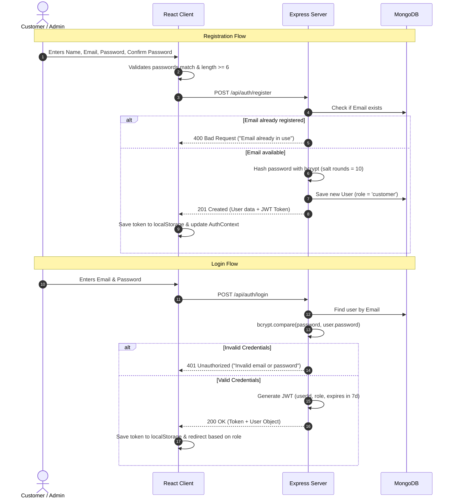
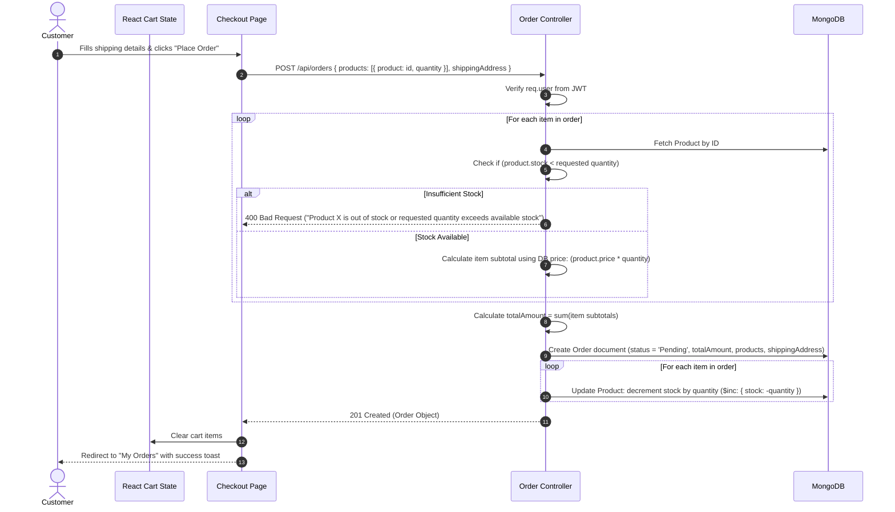

# 🏗️ System Architecture & Design Document

This document describes the high-level system architecture, client-server interactions, data flow, and security mechanisms of the **Mini E-Commerce Demo Project**.

---

## 1. System Overview

The system is designed as a decoupled, stateless **MERN (MongoDB, Express.js, React.js, Node.js)** web application. Communication between the React Single Page Application (SPA) and the Express REST API server takes place exclusively over HTTP(S) with JSON payloads.

```mermaid
flowchart LR
    subgraph Client["Frontend Client (React + Vite)"]
        UI[Tailwind UI Components]
        Router[React Router v6]
        Context[Auth & Cart Contexts]
        Axios[Axios HTTP Client]
    end

    subgraph Server["Backend Server (Node.js + Express)"]
        Middlewares[Auth & Admin Middleware]
        Controllers[API Route Controllers]
        Validation[Request & Business Logic Validation]
        Mongoose[Mongoose ODM]
    end

    subgraph Database["MongoDB Database"]
        ColUser[(Users)]
        ColCat[(Categories)]
        ColProd[(Products)]
        ColOrder[(Orders)]
    end

    UI --> Context
    Context --> Router
    Router --> Axios
    Axios -- "HTTP REST Requests (Bearer JWT)" --> Middlewares
    Middlewares --> Controllers
    Controllers --> Validation
    Validation --> Mongoose
    Mongoose --> Database
```



---

## 2. Layered Architecture

### 2.1 Frontend Architecture (`/client`)

The client is built as a Single Page Application (SPA) using React.js and Vite:

1. **Routing Layer (`react-router-dom`)**:
   - **Public Routes**: Accessible by anyone (`/`, `/products`, `/products/:id`, `/login`, `/register`).
   - **Protected Customer Routes**: Requires an authenticated customer session (`/cart`, `/checkout`, `/my-orders`).
   - **Protected Admin Routes**: Requires an authenticated session with `role === 'admin'` (`/admin`, `/admin/categories`, `/admin/products`, `/admin/orders`).
2. **State Management**:
   - **AuthContext**: Manages user authentication state, token storage (`localStorage`), login, logout, and current user profile.
   - **CartContext**: Manages in-memory and persisted cart items, quantity limits based on available product stock, and subtotal calculations.
3. **Network Layer (Axios)**:
   - Configured with a `baseURL` (`import.meta.env.VITE_API_BASE_URL`).
   - Request Interceptor: Automatically attaches the JWT `Authorization: Bearer <token>` header if a token exists in `localStorage`.
   - Response Interceptor: Catches `401 Unauthorized` responses and triggers automatic logout if the token expires.
4. **Presentation Layer**:
   - Styled with utility-first **Tailwind CSS**.
   - Modular, reusable components (Modals, Tables, Cards, Badges, Loaders).

### 2.2 Backend Architecture (`/server`)

The backend follows the standard Express.js Controller-Model pattern:

1. **Middleware Pipeline**:
   - `cors`: Handles Cross-Origin Resource Sharing for the React client.
   - `express.json()`: Parses incoming JSON request bodies.
   - `authMiddleware`: Validates JWT tokens and attaches `req.user` to requests.
   - `adminMiddleware`: Verifies that `req.user.role === 'admin'`.
   - Global Error Handler: Catches unhandled exceptions and formats consistent JSON error responses.
2. **Controllers & Business Logic**:
   - Handles route handling, request validation, database interactions, and response formatting.
3. **Data Access Layer (Mongoose)**:
   - Schema enforcement, model validation, pre-save hooks (e.g., password hashing with bcrypt), and index definitions.

---

## 3. Authentication & Authorization Flow

Authentication uses stateless JSON Web Tokens (JWT).



### Authorization Middleware Pipeline

```text
Incoming Request
      │
      ▼
authMiddleware
      │── 1. Check Authorization header: 'Bearer <token>'
      │── 2. Verify token signature with JWT_SECRET
      │── 3. Find user in MongoDB (excluding password)
      │── 4. Attach user object to req.user
      ▼
adminMiddleware (Only for Admin routes)
      │── 1. Inspect req.user.role
      │── 2. If req.user.role !== 'admin', return 403 Forbidden
      ▼
Route Controller Handler
```

---

## 4. Order Placement & Stock Integrity Logic

A critical business rule is ensuring **inventory integrity** and **price security**.

### 4.1 Security Principles
1. **Never trust frontend pricing**: The total calculation is performed exclusively on the server by fetching the current price of each item from the `Product` collection.
2. **Prevent race conditions & negative stock**: Ensure stock is checked and decremented atomically.
3. **Cash on Delivery (COD)**: Orders transition to `Pending` immediately upon creation.

### 4.2 Checkout Sequence



---

## 5. Stock Constraint Enforcement

### In the Frontend (Client)
- On the **Product Details** page:
  - If `stock === 0`, disable the "Add to Cart" button and display "Out of Stock".
  - Quantity input is constrained between `1` and `product.stock`.
- In the **Shopping Cart**:
  - The `+` (increment) button is disabled when `item.quantity >= item.stock`.
  - An inline alert appears if a user attempts to add more than available stock.

### In the Backend (Server)
- When `POST /api/orders` executes:
  - Each product's stock is re-verified against MongoDB.
  - If any product cannot fulfill the quantity, the entire order is aborted with an informative error message.
  - Stock is decremented using MongoDB's `$inc` operator.

---

## 6. Error Handling Strategy

All API endpoints return predictable, standardized JSON error objects:

```json
{
  "success": false,
  "message": "Human readable error description",
  "error": "Detailed validation or system message (dev mode only)"
}
```

Standard HTTP status codes utilized:
- `200 OK`: Request succeeded.
- `201 Created`: Resource successfully created.
- `400 Bad Request`: Validation failure, missing fields, or insufficient stock.
- `401 Unauthorized`: Missing or invalid JWT token.
- `403 Forbidden`: Authenticated user lacks admin privileges.
- `404 Not Found`: Resource (product, category, or order) not found.
- `500 Internal Server Error`: Unexpected server exception.
