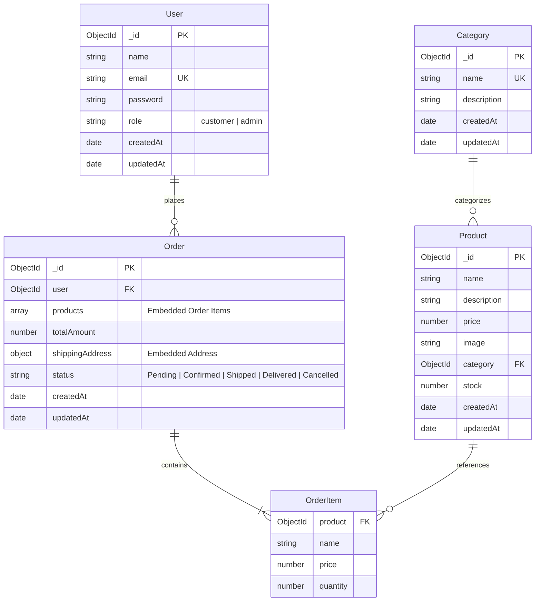
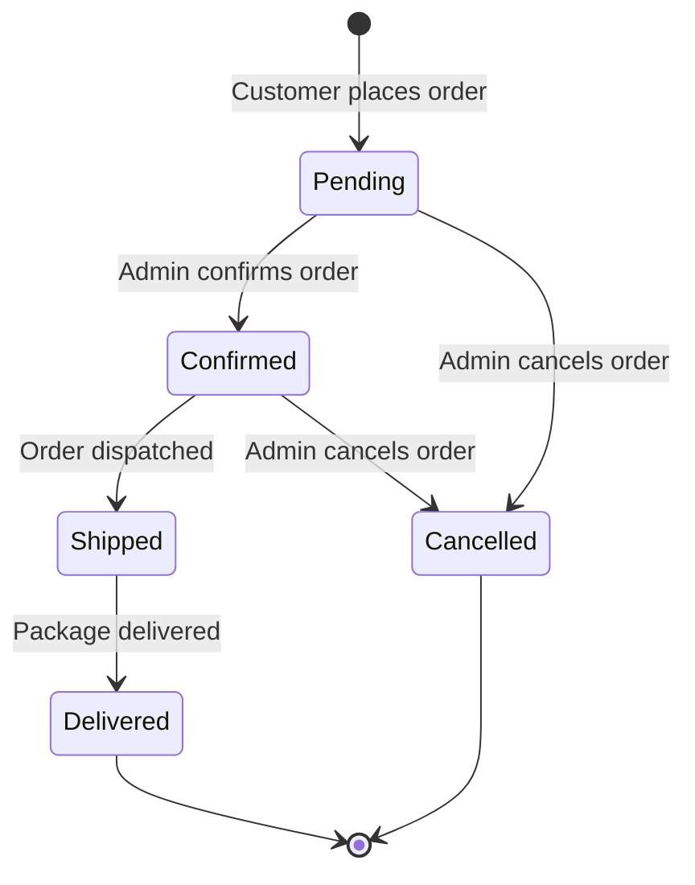

# 🗄️ MongoDB Database Schema & Models

This document defines the data models, relationships, field constraints, validations, and indexing strategies for the **Mini E-Commerce Demo Project**.

The application uses **Mongoose ODM** with **MongoDB** and defines strictly four models:
1. `User`
2. `Category`
3. `Product`
4. `Order`

---

## 1. Entity-Relationship Diagram (ERD)



---

## 2. Models Specification

### 2.1 User Model (`models/User.js`)

Represents both customer accounts and administrators.

| Field | Type | Required | Constraints / Validation | Description |
| :--- | :--- | :--- | :--- | :--- |
| `_id` | `ObjectId` | Auto | Unique Identifier | Primary Key |
| `name` | `String` | Yes | `trim: true`, `minlength: 2`, `maxlength: 60` | Full name of the user |
| `email` | `String` | Yes | `unique: true`, `lowercase: true`, `trim: true`, valid email regex | Unique email address used for login |
| `password` | `String` | Yes | `minlength: 6` | Salted and hashed password (bcrypt) |
| `role` | `String` | No | `enum: ['customer', 'admin']`, default: `'customer'` | Authorization access level |
| `createdAt` | `Date` | Auto | Handled by `{ timestamps: true }` | Account creation timestamp |
| `updatedAt` | `Date` | Auto | Handled by `{ timestamps: true }` | Profile update timestamp |

#### Indexes
- `{ email: 1 }` (Unique)

#### Sample Document
```json
{
  "_id": "660c1f5e8b4a2c001fa3d101",
  "name": "Jane Doe",
  "email": "jane@example.com",
  "password": "$2a$10$e8wzY4J5w4V2k2rU...",
  "role": "customer",
  "createdAt": "2026-10-02T10:00:00.000Z",
  "updatedAt": "2026-10-02T10:00:00.000Z"
}
```

---

### 2.2 Category Model (`models/Category.js`)

Represents product classifications (e.g., Electronics, Fashion, Shoes).

| Field | Type | Required | Constraints / Validation | Description |
| :--- | :--- | :--- | :--- | :--- |
| `_id` | `ObjectId` | Auto | Unique Identifier | Primary Key |
| `name` | `String` | Yes | `unique: true`, `trim: true`, `minlength: 2`, `maxlength: 50` | Unique category name |
| `description` | `String` | No | `trim: true`, `maxlength: 250` | Brief description of the category |
| `createdAt` | `Date` | Auto | Handled by `{ timestamps: true }` | Timestamp created |
| `updatedAt` | `Date` | Auto | Handled by `{ timestamps: true }` | Timestamp updated |

#### Indexes
- `{ name: 1 }` (Unique)

#### Sample Document
```json
{
  "_id": "660c20108b4a2c001fa3d105",
  "name": "Electronics",
  "description": "Smartphones, laptops, headphones, and home electronics",
  "createdAt": "2026-10-02T10:05:00.000Z",
  "updatedAt": "2026-10-02T10:05:00.000Z"
}
```

---

### 2.3 Product Model (`models/Product.js`)

Represents catalog items available for browsing and ordering.

| Field | Type | Required | Constraints / Validation | Description |
| :--- | :--- | :--- | :--- | :--- |
| `_id` | `ObjectId` | Auto | Unique Identifier | Primary Key |
| `name` | `String` | Yes | `trim: true`, `minlength: 2`, `maxlength: 120` | Commercial product name |
| `description` | `String` | Yes | `trim: true` | Detailed product specifications |
| `price` | `Number` | Yes | `min: 0` | Unit price in local currency |
| `image` | `String` | Yes | Valid URL string or image path | Publicly accessible image URL |
| `category` | `ObjectId` | Yes | `ref: 'Category'` | Reference to associated Category |
| `stock` | `Number` | Yes | `min: 0`, `default: 0`, integer check | Available inventory units |
| `createdAt` | `Date` | Auto | Handled by `{ timestamps: true }` | Timestamp created |
| `updatedAt` | `Date` | Auto | Handled by `{ timestamps: true }` | Timestamp updated |

#### Indexes
- `{ category: 1 }`: For fast filtering by category.
- `{ name: 'text', description: 'text' }`: For keyword search queries.

#### Sample Document
```json
{
  "_id": "660c21008b4a2c001fa3d110",
  "name": "Wireless Noise Cancelling Headphones",
  "description": "High fidelity over-ear Bluetooth headphones with active noise cancellation.",
  "price": 149.99,
  "image": "https://images.unsplash.com/photo-1505740420928-5e560c06d30e?w=500",
  "category": "660c20108b4a2c001fa3d105",
  "stock": 25,
  "createdAt": "2026-10-02T10:10:00.000Z",
  "updatedAt": "2026-10-02T10:10:00.000Z"
}
```

---

### 2.4 Order Model (`models/Order.js`)

Represents a placed customer order. Note that historical price and product snapshot are stored directly inside the order items to protect historical accuracy against future price or name changes.

| Field | Type | Required | Constraints / Validation | Description |
| :--- | :--- | :--- | :--- | :--- |
| `_id` | `ObjectId` | Auto | Unique Identifier | Primary Key |
| `user` | `ObjectId` | Yes | `ref: 'User'` | Customer who placed the order |
| `products` | `Array` | Yes | Min 1 item required | Array of ordered items |
| `products.$.product` | `ObjectId` | Yes | `ref: 'Product'` | Referenced Product ID |
| `products.$.name` | `String` | Yes | Snapshot | Name of the product at checkout time |
| `products.$.price` | `Number` | Yes | `min: 0` | Authoritative unit price at checkout |
| `products.$.quantity` | `Number` | Yes | `min: 1` | Quantity ordered |
| `totalAmount` | `Number` | Yes | `min: 0` | Sum total calculated on the server |
| `shippingAddress` | `Object` | Yes | Sub-document | Customer delivery coordinates |
| `shippingAddress.name` | `String` | Yes | `trim: true` | Recipient full name |
| `shippingAddress.phone` | `String` | Yes | `trim: true` | Contact phone number |
| `shippingAddress.address`| `String` | Yes | `trim: true` | Street address / apartment |
| `shippingAddress.city` | `String` | Yes | `trim: true` | City / Town |
| `shippingAddress.pincode`| `String` | Yes | `trim: true` | Postal / PIN Code |
| `status` | `String` | Yes | `enum: ['Pending', 'Confirmed', 'Shipped', 'Delivered', 'Cancelled']`, default: `'Pending'` | Order lifecycle state |
| `createdAt` | `Date` | Auto | Handled by `{ timestamps: true }` | Order placement timestamp |
| `updatedAt` | `Date` | Auto | Handled by `{ timestamps: true }` | Status change timestamp |

#### Order Status State Machine



#### Indexes
- `{ user: 1, createdAt: -1 }`: Optimizes customer order history queries.
- `{ status: 1 }`: For filtering orders in the Admin Panel.
- `{ createdAt: -1 }`: For chronological display in Admin Dashboard.

#### Sample Document
```json
{
  "_id": "660c22888b4a2c001fa3d150",
  "user": "660c1f5e8b4a2c001fa3d101",
  "products": [
    {
      "product": "660c21008b4a2c001fa3d110",
      "name": "Wireless Noise Cancelling Headphones",
      "price": 149.99,
      "quantity": 2
    }
  ],
  "totalAmount": 299.98,
  "shippingAddress": {
    "name": "Jane Doe",
    "phone": "+1 555-0199",
    "address": "742 Evergreen Terrace",
    "city": "Springfield",
    "pincode": "97477"
  },
  "status": "Pending",
  "createdAt": "2026-10-02T10:30:00.000Z",
  "updatedAt": "2026-10-02T10:30:00.000Z"
}
```

---

## 3. Data Integrity & Validation Rules

1. **Email Uniqueness & Case Normalization**:
   - `lowercase: true` ensures that `User@Example.com` and `user@example.com` are treated identically.
2. **Positive Numbers**:
   - Product prices must satisfy `price >= 0`.
   - Product stock must satisfy `stock >= 0`.
   - Order quantities must satisfy `quantity >= 1`.
3. **Password Security**:
   - Passwords must be at least 6 characters in length.
   - Plaintext passwords must never be stored in MongoDB; hashing is executed via a Mongoose `pre('save')` hook.
4. **Referential Integrity**:
   - Before deleting a Category, the backend verifies that no Products reference that category ID.
   - Products embedded in orders preserve their snapshot `name` and `price` so that future catalog edits do not corrupt past invoices.
