# 🚀 Step-by-Step Development Plan & Roadmap

This document outlines the structured, phase-by-phase implementation roadmap for building the **Mini E-Commerce Demo Project**.

---

## 📅 Roadmap Overview

```mermaid
gantt
    title Development Phases
    dateFormat  X
    axisFormat  Day %d
    section Phase 1
    Project Scaffolding & Setup        :p1, 0, 1
    section Phase 2
    Backend Auth & Security            :p2, 1, 2
    section Phase 3
    Category & Product APIs            :p3, 2, 3
    section Phase 4
    Customer Storefront UI             :p4, 3, 5
    section Phase 5
    Cart & Checkout with Stock Flow    :p5, 5, 7
    section Phase 6
    Admin Panel & Order Management     :p6, 7, 9
    section Phase 7
    Polish, Validation & Demo Test     :p7, 9, 10
```

---

## 🛠️ Phase 1: Foundation & Project Scaffolding

### Goals
Set up repository structure, initialize backend Express application, create React + Vite frontend, and configure Tailwind CSS.

### Tasks
- [ ] Initialize `/server`:
  - `npm init -y` and install dependencies: `express`, `mongoose`, `dotenv`, `cors`, `bcryptjs`, `jsonwebtoken`.
  - Install dev dependency: `nodemon`.
  - Setup `src/server.js` with basic healthcheck endpoint (`GET /api/health`).
  - Configure MongoDB connection with Mongoose in `src/config/db.js`.
  - Create `.env.example` and `.env` template.
- [ ] Initialize `/client`:
  - `npm create vite@latest client -- --template react`.
  - Install dependencies: `react-router-dom`, `axios`, `lucide-react`, `clsx`, `tailwind-merge`.
  - Install and initialize Tailwind CSS: `npm install -D tailwindcss postcss autoprefixer && npx tailwindcss init -p`.
  - Configure `tailwind.config.js` with content paths.
  - Setup Axios client instance in `src/services/api.js`.

---

## 🔐 Phase 2: Authentication & Authorization (Backend)

### Goals
Implement secure customer registration, login, and JWT-based role authorization for administrators and customers.

### Tasks
- [ ] Implement `User` model (`server/src/models/User.js`):
  - Fields: `name`, `email`, `password`, `role`.
  - Pre-save hook for password hashing with `bcryptjs`.
  - Instance method: `matchPassword(enteredPassword)`.
- [ ] Implement token utility:
  - `generateToken(userId, role)` signing JWT with `JWT_SECRET`.
- [ ] Implement Middlewares (`server/src/middleware/`):
  - `authMiddleware`: Extracts token from `Authorization: Bearer <token>`, verifies signature, attaches user to `req.user`.
  - `adminMiddleware`: Verifies `req.user.role === 'admin'`.
- [ ] Implement Auth Controller & Routes (`server/src/routes/authRoutes.js`):
  - `POST /api/auth/register`: Validate input, ensure email is unique, return token.
  - `POST /api/auth/login`: Validate credentials, return token and user profile.
  - `GET /api/auth/me`: Protected route returning current user.
- [ ] Create initial Admin seeder script (`server/src/utils/seedAdmin.js`) to create default admin account if not present.

---

## 📦 Phase 3: Category & Product Management (Backend)

### Goals
Implement complete CRUD APIs for product categories and catalog items, supporting search and filtering.

### Tasks
- [ ] Implement `Category` model (`server/src/models/Category.js`):
  - Fields: `name` (unique), `description`.
- [ ] Implement Category Routes (`server/src/routes/categoryRoutes.js`):
  - `GET /api/categories`: Public list of all categories.
  - `POST /api/categories`: Admin only creation.
  - `PUT /api/categories/:id`: Admin only update.
  - `DELETE /api/categories/:id`: Admin only delete (with check preventing deletion if products exist).
- [ ] Implement `Product` model (`server/src/models/Product.js`):
  - Fields: `name`, `description`, `price`, `image`, `category`, `stock`.
  - Text search index on `name` and `description`.
- [ ] Implement Product Routes (`server/src/routes/productRoutes.js`):
  - `GET /api/products`: Public search and category filter (`?category=...&search=...`).
  - `GET /api/products/:id`: Public single product lookup.
  - `POST /api/products`: Admin only product creation.
  - `PUT /api/products/:id`: Admin only product update.
  - `DELETE /api/products/:id`: Admin only product removal.

---

## 🛍️ Phase 4: Customer Storefront UI (Frontend)

### Goals
Build public-facing store pages with clean Tailwind styling, search, and category filtering.

### Tasks
- [ ] Setup Global Contexts:
  - `AuthContext`: Store token, user, login, register, logout handlers.
  - `CartContext`: Manage cart items, local storage sync, quantity limit checks.
- [ ] Build Common UI Components:
  - `Navbar`: Responsive navigation, search bar, cart item counter, user dropdown.
  - `Footer`: Minimal footer with project info.
  - `ProductCard`: Thumbnail, category badge, title, price, in-stock badge, "Add to Cart" button.
- [ ] Implement Customer Pages:
  - `Home`: Hero banner, category pills, featured products grid.
  - `Products`: Filter bar (`All | Electronics | Fashion | Shoes`), search bar, responsive product grid, empty state.
  - `ProductDetails`: High-res image, stock availability count, quantity selector capped by stock, "Add to Cart" button.
  - `Login` & `Register`: Clean card layout, validation feedback, password mismatch alert.

---

## 🛒 Phase 5: Cart, Checkout & Order Fulfillment (Full-Stack)

### Goals
Implement interactive shopping cart with stock boundaries, Cash on Delivery checkout, and backend stock deduction.

### Tasks
- [ ] Build Shopping Cart (`client/src/pages/Cart.jsx`):
  - Item listing with quantity increment/decrement.
  - Prevent incrementing beyond `product.stock`.
  - Remove item and calculate total price.
  - Empty cart state with "Continue Shopping" CTA.
- [ ] Build Checkout Page (`client/src/pages/Checkout.jsx`):
  - Shipping address form (Name, Phone, Address, City, Pincode).
  - Cash on Delivery indicator.
  - Order summary breakdown.
- [ ] Implement `Order` model (`server/src/models/Order.js`):
  - Fields: `user`, `products`, `totalAmount`, `shippingAddress`, `status`, `createdAt`.
- [ ] Implement Order Endpoints (`server/src/routes/orderRoutes.js`):
  - `POST /api/orders`:
    - Customer protected.
    - Fetch each product price from MongoDB (never trust client price).
    - Validate sufficient stock for every product.
    - Create Order in MongoDB.
    - Atomically reduce product stock via `$inc: { stock: -quantity }`.
  - `GET /api/orders/my-orders`: Return orders for authenticated customer.
- [ ] Build "My Orders" Page (`client/src/pages/MyOrders.jsx`):
  - Customer order history with status badges and item summaries.

---

## 📊 Phase 6: Admin Dashboard & Order Management

### Goals
Create responsive admin control panel for categories, products, and order status updates.

### Tasks
- [ ] Build Admin Layout (`client/src/components/admin/AdminLayout.jsx`):
  - Persistent sidebar on desktop, slide-out drawer on mobile.
  - Links: Dashboard, Categories, Products, Orders.
  - Protected route guard (`AdminRoute`).
- [ ] Build Admin Category Management (`client/src/pages/admin/AdminCategories.jsx`):
  - Table of categories with Add, Edit, Delete modals.
  - Confirmation dialog before deletion.
- [ ] Build Admin Product Management (`client/src/pages/admin/AdminProducts.jsx`):
  - Table showing thumbnail, name, price, stock, category.
  - Add & Edit modal with field validation.
  - Delete product confirmation dialog.
- [ ] Build Admin Order Management (`client/src/pages/admin/AdminOrders.jsx`):
  - Master order table with customer name, items, total, and current status.
  - Status dropdown allowing instant update: `Pending`, `Confirmed`, `Shipped`, `Delivered`, `Cancelled`.
  - Connect to `PATCH /api/admin/orders/:id/status`.

---

## 🎯 Phase 7: Polish, Validation & Acceptance Verification

### Goals
Perform end-to-end verification, add loading/empty states, test edge cases, and ensure codebase quality.

### Tasks
- [ ] Verify Demo Flow:
  1. Admin logs in.
  2. Admin creates category (e.g., "Electronics").
  3. Admin adds product with price and stock (e.g., "Smartphone", stock: 5).
  4. Product appears on public storefront.
  5. User registers or logs in.
  6. User filters by category and searches for product.
  7. User adds product to cart and tests quantity ceiling (cannot exceed 5).
  8. User enters shipping details and selects Cash on Delivery.
  9. User places order; cart is cleared and order appears in "My Orders".
  10. Product stock is reduced from 5 to 4 in database.
  11. Admin views the new order in Admin Dashboard.
  12. Admin changes status to "Confirmed" and then "Shipped".
- [ ] Validate Edge Cases:
  - Trying to order when stock is 0 (blocked).
  - Frontend price tampering (ignored, backend computes true total).
  - Deleting a category with active products (prevented with error message).
  - Accessing `/admin` routes with customer token (blocked with 403 Forbidden).

---

## ✅ Definition of Done (DoD)

- [x] Comprehensive documentation (`.md`) pushed to GitHub repository.
- [ ] Clean and linted code adhering to MERN best practices.
- [ ] Zero payment gateway, review, or multi-vendor bloat (strictly focused scope).
- [ ] Fully responsive UI across desktop, tablet, and mobile.
- [ ] Robust server-side validation and stock integrity guarantees.
